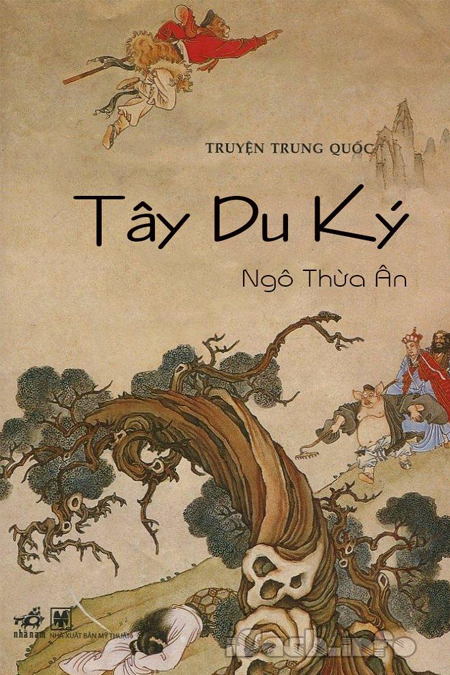

<!--truncate-->

# Chia sẻ truyện Tây Du Ký 1988

:::note

Nội dung được dịch bởi tác giả tổng hợp trên Internet. Mọi vấn đề liên quan đến bản quyền, vui lòng gửi email liên hệ: cuongpv@sudosys.com. Trân trọng cảm ơn.
:::

## GIỚI THIỆU SÁCH

Tây Du Ký là một trong những tác phẩm kinh điển trong văn học Trung Hoa. Được xuất bản với tác giả giấu tên trong những năm 1590 và không có bằng chứng trực tiếp còn tồn tại để biết tác giả của nó, nhưng tác phẩm này thường được cho là của tác giả Ngô Thừa Ân. Tiểu thuyết thuật lại chuyến đi đến Ấn Độ của nhà sư Huyền Trang (Đường Tam Tạng) đi lấy kinh.

Theo [Wikipedia](https://vi.wikipedia.org/wiki/T%C3%A2y_du_k%C3%BD)

## TẢI SÁCH VỀ

Đa số hệ điều hành đều không hỗ trợ định dạng đọc file `.prc`. Vậy sau khi bạn download sách `TayDuKy.prc` thì bạn cần phải download thêm phần mềm `mobireader` để có thể đọc cuốn sách này. Tất cả link download đều bên dưới:

Link Download [Tây Du Ký 1988](../static/files/TayDuKy.prc)

Phần mềm đọc file PRC [MobiReaderSetup](../static/files/mobireadersetup.msi)
