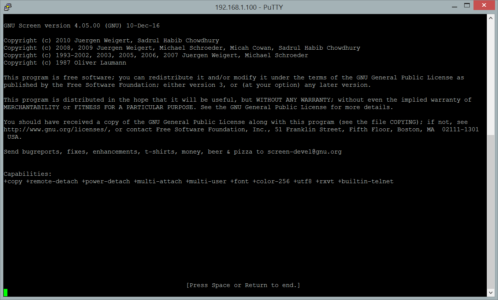

<!--truncate-->

:::note

Nội dung được tác giả tổng hợp bằng kiến thức hạn hẹp của bản thân. Vui lòng đọc tài liệu đầy đủ chính thức từ trang chủ.
:::

## GIỚI THIỆU

Để tránh việc gián đoạn trong quá trình copy dữ liệu lớn như cúp điện, mất mạng v.v... Ảnh hưởng đến quá trình copy hoặc download. Ta có giải phái phía dưới như sau:

Giải pháp là sử dụng `Screen`, một ứng dụng trên CentOS và Ubuntu đều có. Cho phép bạn chạy ứng dụng ngầm (attach) phía bên trong chương trình `Screen` mà không cần thông qua máy bạn khi bạn thoát khỏi `screen`. Tất nhiên bạn có thể truy cập lại `screen` (deattach) bất cứ lúc nào, ở đâu và trên máy tính nào một cách dễ dàng.



Để biết thêm thông tin chi tiết, vui lòng gõ dòng lệnh sau khi đã cài đặt screen: `man screen`.

## CÀI ĐẶT

Thông thường, việc trao đỗi dữ liệu lớn giữa 2 máy chủ. Nên `screen` sẽ được cài chủ yếu trên một trong hai máy chủ; máy mà chúng ta gõ lệnh và phải chờ đợi. Cụ thể là sau khi cài đặt xong, thay vì bạn treo máy ở đó cả ngày. Thì bạn có thể dùng screen để ẩn nó xuống gọi là `attach` trên máy chủ đó. Để tránh việc laptop của bạn đang `SSH` lên bị mất kết nối hoặc cúp điện v.v...

Vậy việc bạn `attach` bằng `screen` lên máy chủ, sẽ giúp máy chủ không phụ thuộc vào terminal trên máy cá nhân của bạn nữa. Vậy tóm lại sau khi bạn đã chạy ngầm (attach) lên bằng `screen`, bạn không phải lo lắng về máy tính cá nhân mình xảy ra vấn đề nữa.

### Trên CentOS

```shell
yum update
update install screen
```

### Trên Ubuntu

```shell
apt update
apt install screen
```

## SỬ DỤNG

### CHẠY NGẦM VỚI SCREEN

Để chạy ngầm (attach), trên màn hình terminal, ta gõ:

```shell
screen
```

Bạn sẽ được đưa vào terminal mới. Lúc này, bạn có thể copy dữ liệu, move hoặc làm bất cứ thao tác gì như terminal thông thường. Sau khi bạn đã làm xong các thao tác, đến bước cuối cùng là chờ đợi quá trình copy, download v.v... tiến trình này chạy rất lâu, thì bạn có thể nhấn phím lần lượt là:

```
Giữ Ctrl
Bấm A
Bấm D
```

Có nghĩa là chúng ta chỉ `giữ nút Ctrl`, không giữ nút "A" và cũng không giữ nút "D", `chỉ nhấn` vào thôi.

Vậy là cửa sổ lệnh của bạn đã được chạy ngầm (attach), và bạn sẽ được đưa về terminal ban đầu của mình. Lúc này, tiến trình không còn phụ thuộc vào terminal của bạn nữa.

### BẬT LẠI SCREEN ĐANG CHẠY NGẦM

#### Đối với chỉ có 1 screen

Đối với có một screen; việc bật lại (deattach); bạn chỉ cần gõ:

```
screen -r
```

Nó sẽ tự động bật lại (deattach) ngay luôn.

#### Đối với 2 hoặc nhiều hơn 2 screen

Đối với trường hợp này, khi bạn gõ:

```
 screen -r
```

Bạn sẽ được gợi ý lại `các screen` mà bạn đã ẩn đi. Bạn cần phải gõ <code>screen -r (mã của screen) </code>lúc bạn ẩn đi. Ví dụ:

```
 screen -r screen-abc-2021-03-01
```

Thì bạn sẽ được đưa về screen đó. Tuy nhiên nếu không đúng screen bạn mong muốn thì đừng lo lắng, vì chỉ cần thực hiện giấu đi lại như hướng dẫn trên rồi gõ lại lệnh screen với mã khác thôi.
